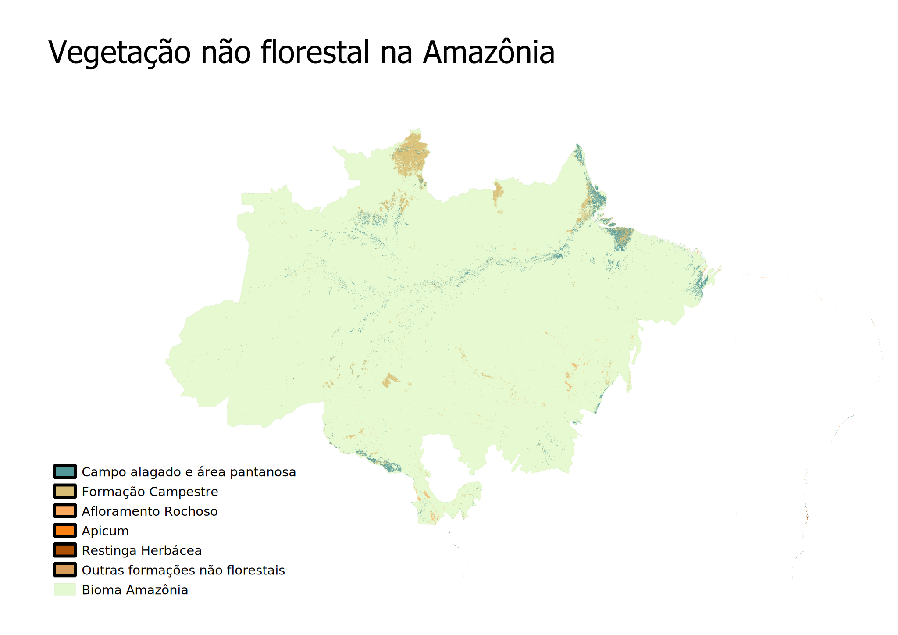
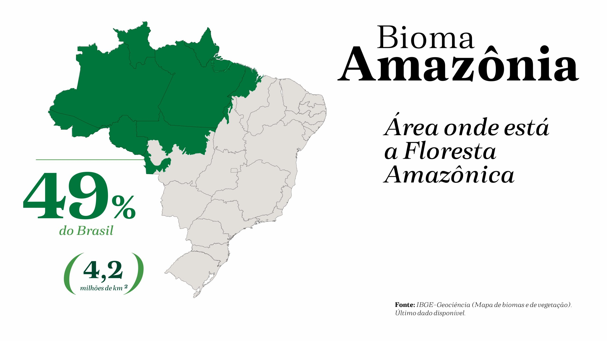
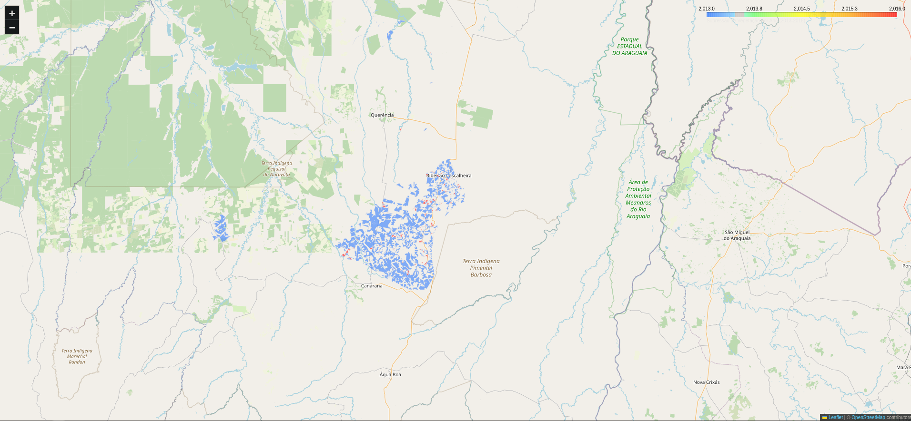

# Supressão de vegetação não florestal no bioma amazônia
## Sumário

- [Introdução](https://github.com/fernandessfae/supressao_nao_florestal_no_bioma_amazonia/tree/master?tab=readme-ov-file#introdu%C3%A7%C3%A3o)
- [Aspecto Legal](https://github.com/fernandessfae/supressao_nao_florestal_no_bioma_amazonia/tree/master?tab=readme-ov-file#aspecto-legal)
- [Obtenção dos dados](https://github.com/fernandessfae/supressao_nao_florestal_no_bioma_amazonia/tree/master?tab=readme-ov-file#obten%C3%A7%C3%A3o-dos-dados)
- [Análise dos dados](https://github.com/fernandessfae/supressao_nao_florestal_no_bioma_amazonia/tree/master?tab=readme-ov-file#an%C3%A1lise-dos-dados)
    - [Contagem de ocorrências de áreas suprimidas por ano](https://github.com/fernandessfae/supressao_nao_florestal_no_bioma_amazonia/tree/master?tab=readme-ov-file#contagem-de-ocorr%C3%AAncias-de-%C3%A1reas-suprimidas-por-ano)
    - [Somatório de áreas suprimidas por ano (km2)](https://github.com/fernandessfae/supressao_nao_florestal_no_bioma_amazonia/tree/master?tab=readme-ov-file#somat%C3%B3rio-de-%C3%A1reas-suprimidas-por-ano-km2)
- [Conclusão](https://github.com/fernandessfae/supressao_nao_florestal_no_bioma_amazonia/tree/master?tab=readme-ov-file#conclus%C3%A3o)

## Introdução

O bioma da amazônia, que refere-se diretamente a sua floresta, tem um importância relevante para o Brasil em diversos aspectos. No econômico, a obtenção de produtos decorrente da fauna e flora ali presente. No aspecto social, ajuda os residentes daquelas áreas de modo a tirar o sustento daquele local. No aspecto ambiental, tem uma tamanha relevância no cenário nacional e internacional, seja por causa da sua fauna e  flora, bacia hidrográfica relevante. 
A vegetação não florestal refere-se a retirada de formação de formações vegetais que não se enquadram na definição tradicional de floresta, como campos alagados, áreas pantanosas, formações campestres e afloramentos rochosos.

 

<b>Representação de vegetação não florestal no bioma amazônia - Fonte: IPAM</b>
 

 Infelizmente, a supressão dessa vegetação traz impactos ambientais consideráveis. Alguns exemplos são:  
<ul>
<li><b>Perda de biodiversidade</b>: A destruição desses ecossistemas leva à extinção de espécies e à perda de habitats únicos.</li>
<li><b>Alterações no ciclo da água</b>: A remoção da vegetação afeta a capacidade do solo de reter água, levando a inundações e secas.</li>
<li><b>Emissões de carbono</b>: A destruição da vegetação libera grandes quantidades de carbono na atmosfera, contribuindo para as mudanças climáticas.</li>
<li><b>Degradação do solo</b>: A remoção da vegetação torna o solo mais suscetível à erosão e à perda de nutrientes.</li>
</ul>
As principais principais causas que levam a supressão da vegetação são:
<ul>
<li><b>Expansão agrícola</b>: A conversão de áreas não florestais em pastagens e lavouras é uma das principais causas da supressão.</li>
<li><b>Mineração</b>: A extração de minerais leva à destruição da vegetação e à contaminação do solo e da água.</li>
<li><b>Construção de infraestrutura</b>: A construção de estradas, hidrelétricas e outras obras de infraestrutura causa a remoção da vegetação.</li>
<li><b>Incêndios florestais</b>: Embora a vegetação não florestal seja mais resistente ao fogo do que a floresta, incêndios frequentes podem levar à sua degradação.</li>
</ul>

No Brasil, os estados que abragem o bioma amazônia são chamados de amazônia legal. Esse conceito é utilizado para delimitar a área de atuação da Superintendência do Desenvolvimento da Amazônia (SUDAM) e para o planejamento e promoção do desenvolvimento social e econômico dos estados da região amazônica.

## Aspecto Legal

<b>Tucano, uma espécie bastante comum no bioma amazônia</b>
 

Por mais que a supressão de vegetação não florestal possa trazer diversos impactos ambientais, ela é possível de ser feita, nos termos da lei. Sim, a supressão vegetal, é regulamentada por conjuntos de leis e normas, podendo variar desde a nível federal até municipal. Mas, para isso ocorrer, são estabelecidos critérios e restrições para, justamente, garantir a proteção e o menor impacto ambiental.
No âmbito federal, o <b>código florestal</b> (lei 12.651/2012), de modo geral, e a <b>lei da mata atlântica</b> (lei 11.428/2006), de modo específico, são as leis que regem a supressão de vegetação.

 

Também existem as resoluções do Conselho Nacional do Meio Ambiente (CONAMA) que permitem a prática de supressão vegetal, como: 
<ul>
<li><b>Resolução 369/2006</b>: Estabelece os casos de excepcionalidade em que é permitida a intervenção ou supressão da vegetação em áreas de preservação permanente (APPs). Define as intervenções de baixo impacto ambiental passíveis de autorização, estabelece procedimentos para autorização de intervenções e supressão de vegetação em APP, e dá outras providências.</li>
<li><b>Resolução 237/1997</b>: Regulamenta os aspectos de licenciamento ambiental estabelecidos na Política Nacional do Meio Ambiente (PNMA), assim como estabelece os procedimentos e critérios para o licenciamento ambiental de atividades que possam causar impacto ambiental, incluindo a supressão de vegetação.</li>
<li><b>Resolução 289/2001</b>: Estabelece diretrizes para o licenciamento Ambiental de Projetos de Assentamentos de Reforma Agrária. O licenciamento dos assentamentos envolvem a supressão de vegetação.</li>
<li><b>Resolução 379/2006</b>: Cria e regulamenta sistema de dados e informações sobre a gestão florestal no âmbito do Sistema Nacional do Meio Ambiente (SISNAMA), e auxilia no monitoramento da supressão da vegetação, através de informações sobre a gestão florestal.</li>
</ul>

## Obtenção dos dados

Os dados foram obtidos através do site do IBAMA, cujo link da página estará <a href='https://dados.gov.br/dados/conjuntos-dados/supressao-de-vegetacao-nao-florestal-no-bioma-amazonia1'>aqui</a>. Utilizando a linguagem de programação python, pegou-se a API disponibilizada no site para a extração dos dados, inclusive os geoespaciais, sendo estes representações da áreas de supressão do bioma amazônia nos estados onde estão presentes. Sem mais delongas, vamos a análise dos dados.

## Análise dos dados

<b>Localização e informações do bioma amazônia</b> <b>Fonte: IBGE - Geociência (Mapa de biomas e vegetação)</b>
 

Analisando os dados de cada estado que possui a vegetação suprimida do bioma amazônico, entre os anos de 2013 a 2016, podemos analisar das seguintes formas abaixo:
 

### Contagem de ocorrências de áreas suprimidas por ano

<table>
    <tr>
    <th></th>
    <th>AC</th>
    <th>AM</th>
    <th>AP</th>
    <th>MA</th>
    <th>MT</th>
    <th>PA</th>
    <th>RO</th>
    <th>RR</th>
    <th>TO</th>
    </tr>
    <tr style="background-color: #f2f2f2;">
    <th>2013</th>
    <th>26</th>
    <th>172</th>
    <th>195</th>
    <th>400</th>
    <th>1923</th>
    <th>474</th>
    <th>465</th>
    <th>563</th>
    <th>148</th>
    </tr>
    <tr>
    <th>2014</th>
    <th>-</th>
    <th>-</th>
    <th>-</th>
    <th>587</th>
    <th>245</th>
    <th>13</th>
    <th>-</th>
    <th>135</th>
    <th>-</th>
    </tr>
    <tr style="background-color: #f2f2f2;">
    <th>2015</th>
    <th>-</th>
    <th>-</th>
    <th>-</th>
    <th>-</th>
    <th>7</th>
    <th>-</th>
    <th>-</th>
    <th>-</th>
    <th>-</th>
    </tr>
    <tr>
    <th>2016</th>
    <th>-</th>
    <th>31</th>
    <th>166</th>
    <th>314</th>
    <th>1222</th>
    <th>222</th>
    <th>120</th>
    <th>261</th>
    <th>38</th>
    </tr>
</table> 

Observando essa tabela, dá para tirar várias informações relevantes como, por exemplo:   

<ul>
    <li>2013 foi o ano onde todos os estados tiveram ocorrências de áreas suprimidas.</li>
    <li>2015 foi o ano que não houveram dados para a análise na maioria dos estados.</li>
    <li>O estado do Acre (AC) possui o menor número de ocorrência somadas dentre o período.</li>
    <li>O estado do Mato Grosso (MT) possui o maior número de ocorrência somadas dentre o período.</li>
    <li>O estado do Mato Grosso (MT) possui ocorrências em todos os anos, com uma média de, aproximadamente, 849 ocorrências por ano.</li>
</ul>

### Somatório de áreas suprimidas por ano (km2)

<table>
    <tr>
        <th></th>
        <th>AC</th>
        <th>AM</th>
        <th>AP</th>
        <th>MA</th>
        <th>MT</th>
        <th>PA</th>
        <th>RO</th>
        <th>RR</th>
        <th>TO</th>
    </tr>
    <tr style="background-color: #f2f2f2;">
        <th>2013</th>
        <th>1,38</th>
        <th>113,91</th>
        <th>510,55</th>
        <th>212,69</th>
        <th>7599,86</th>
        <th>485,94</th>
        <th>831,41</th>
        <th>706,18</th>
        <th>54,04</th>
    </tr>
    <tr>
        <th>2014</th>
        <th>-</th>
        <th>-</th>
        <th>-</th>
        <th>157,12</th>
        <th>914,29</th>
        <th>7,08</th>
        <th>-</th>
        <th>172,64</th>
        <th>-</th>
    </tr>
    <tr style="background-color: #f2f2f2;">
        <th>2015</th>
        <th>-</th>
        <th>-</th>
        <th>-</th>
        <th>-</th>
        <th>54,82</th>
        <th>-</th>
        <th>-</th>
        <th>-</th>
        <th>-</th>
    </tr>
    <tr>
        <th>2016</th>
        <th>-</th>
        <th>7,41</th>
        <th>165,87</th>
        <th>85,77</th>
        <th>665,80</th>
        <th>180,03</th>
        <th>182,72</th>
        <th>182,91</th>
        <th>6,29</th>
    </tr>
</table>

Observando essa outra tabela, dá para tirar várias informações relevantes como, por exemplo:   

<ul>
    <li>2013 foi o ano onde todos os estados tiveram o maior somatório de áreas suprimidas do bioma amazônico.</li>
    <li>2015 foi o ano onde não houve dados sobre as áreas suprimidas nos estados, exceto MT.</li>
    <li>O estado do Acre (AC) possui a menor área somada dentre o período.</li>
    <li>O estado do Mato Grosso (MT) possui o maior área suprimida somada dentre o período.</li>
    <li>O estado do Mato Grosso (MT) possui supressão de aŕea do bioma amazônico em todos os anos, com uma média de, aproximadamente, 2.308,7 km2 anual.</li>
</ul>

Falando especificamente das áreas suprimidas, e comparando com a imagem acima, podemos ter mais informações relevantes. Abaixo teremos uma tabela com o somatório total da área de bioma suprimido, nos estados citados,em cada ano, em comparação com a quantidade de campos de futebol, padrão FIFA (105m x 68m), e o percentual em relação ao bioma amazônico.   

<table>
    <tr>
        <th>Ano</th>
        <th>Área total (km2)</th>
        <th>Qt. campo futebol (FIFA)</th>
        <th>Área bioma amazônia (%)</th>
    </tr>
    <tr style="background-color: #f2f2f2;" align='center'>
        <th>2013</th>
        <th>10.515,96</th>
        <th>1.472.823</th>
        <th>0,25</th>
    </tr>
    <tr align='center'>
        <th>2014</th>
        <th>1.251,13</th>
        <th>175.228</th>
        <th>0,03</th>
    </tr>
    <tr style="background-color: #f2f2f2;" align='center'>
        <th>2015</th>
        <th>54,82</th>
        <th>7.677</th>
        <th>0,001</th>
    </tr>
    <tr align='center'>
        <th>2016</th>
        <th>1.476,8</th>
        <th>206.834</th>
        <th>0,03</th>
    </tr>
</table>

 

É interessante notar que a área suprimida é grande em relação aos campos de futebol, ao mesmo tempo é muito pequena em relação a área do bioma presente no país, sem contar que esse mesmo bioma é encontrado na maioria dos países sul-americanos.

## Conclusão

<b>Mapa interativo das áreas suprimidas em MT - Fonte: Arquivo Próprio</b>
 

A obtenção dos dados, quanto da contagem de ocorrência quanto a área total suprimida, ajuda a entender como entender e criar soluções para o problema específico, como também mostra o tamanho e relevância desse bioma no cenário nacional. Além das informações exibidas em tabelas acima, também foi possivel criar um mapa, que pode ser acessado através desse <a href='https://github.com/fernandessfae/supressao_nao_florestal_no_bioma_amazonia/blob/master/amazonia_suppression_map_2013_2016_detailed_debug.html'>link</a>. Caso não seja possível visualizá-lo, também foi disponibilizado o código que faz a geração do mapa, basta clicar <a href='https://github.com/fernandessfae/supressao_nao_florestal_no_bioma_amazonia/blob/master/amazon_geodata_map.py'>aqui</a>.
